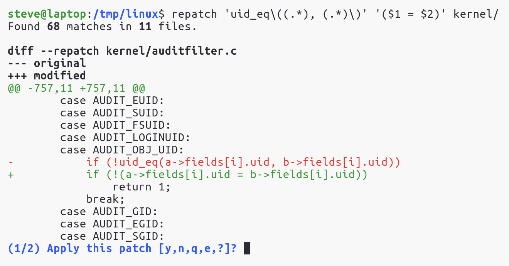

# re:patch

[![Latest Version]][crates.io]

re:patch is a line-oriented find-and-replace tool with a [`git add
--patch`][git-add-patch]-like interface. Regular expressions and capture groups
are supported, and re:patch can be used with files and directories. Linux and
macOS are currently supported (macOS on a reasonable-efforts basis).

> [!WARNING]  
> This tool is still in development. While it Works For Me™, it does not yet
> have many tests. It's recommended to only use this in directories that are
> version controlled.

[crates.io]: https://crates.io/crates/repatch
[Latest Version]: https://img.shields.io/crates/v/repatch.svg
[git-add-patch]: https://git-scm.com/docs/git-add#Documentation/git-add.txt---patch

### Install

You can install from source or through crates.io. You must have a recent
[rust/cargo][rust] toolchain installed.

```bash
# install the latest release from crates.io
cargo install repatch

# install the latest development version
git clone https://github.com/stevenengler/repatch.git
cargo install --path repatch
```

[rust]: https://www.rust-lang.org/tools/install

### Example

<picture>
  <source media="(prefers-color-scheme: dark)" srcset="docs/assets/example-dark.png">
  
</picture>

### Notes

Similar to [ripgrep][ripgrep], gitignore rules are respected and hidden
files/directories are ignored.

The editor used to edit patches can be configured using environment variables
or the git configuration. The search priority is `VISUAL`, `EDITOR`,
`GIT_EDITOR`, and `git config core.editor`. Otherwise vim is used. Like `sudo
-e` the editor value is split by whitespace characters and executed, and is not
interpreted by a shell.

Patches shown in the terminal will have ANSI escape sequences replaced with
safe versions.

Like most text editors, files are replaced and not edited in-place. This means
that the file owner or other metadata may change after editing. The new file
will have the same read/write/execute permissions as the original file. You
will also need enough temporary disk space for this second file. For example if
you're editing a 10 GB file, you must have at least 10 GB of disk space free so
that the new file can be written before the original file is deleted.

Large files (larger than the amount of available memory) are supported as long
as they have a sufficient number of lines. For example a 10 GB file with 10,000
lines should work fine, but a 10 GB file with a single line might exhaust the
system memory and would not look very nice in the terminal.

[ripgrep]: https://github.com/BurntSushi/ripgrep

### Acknowledgements

Most of the heavy lifting is done by the [ripgrep][ripgrep] family of crates,
[clap][clap], and [diffy][diffy].

[clap]: https://docs.rs/clap/latest/clap/
[diffy]: https://docs.rs/diffy/latest/diffy/
